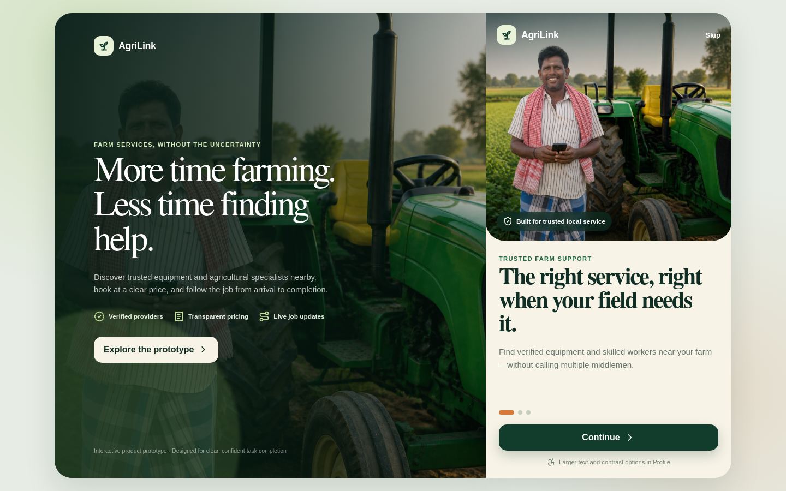
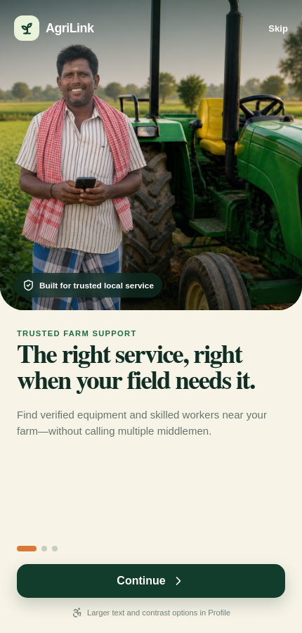
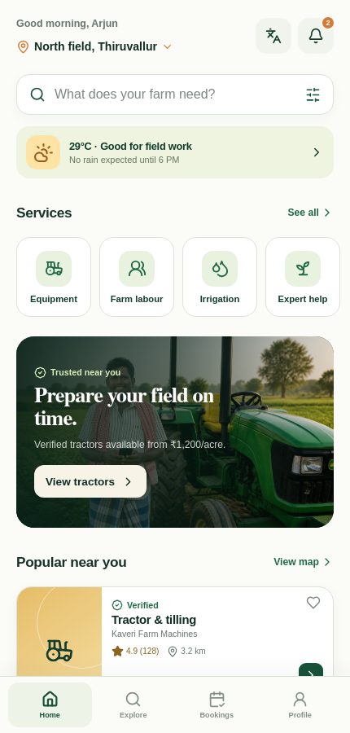
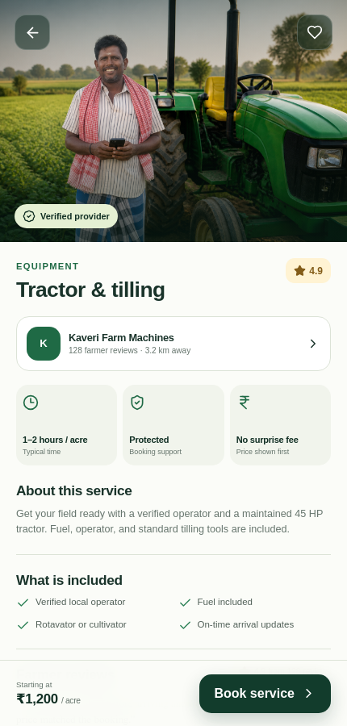
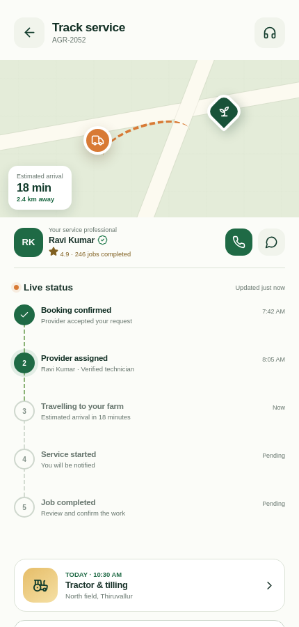
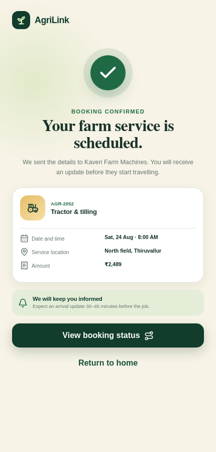

# AgriLink agricultural services prototype

AgriLink is a mobile-first React prototype that helps farmers discover trusted agricultural services, compare transparent prices, complete a booking, choose a payment method, and track the provider through job completion.

The product direction is based on the [AgriLink UI/UX case-study concept](https://www.behance.net/gallery/250963129/AgriLink-Agricultural-Service-App-UIUX-Case-Study). The implementation and bundled hero photograph in this repository are original prototype assets.

## Application preview

[](docs/screenshots/00-desktop-overview.png)

| Onboarding | Service discovery |
| --- | --- |
| [](docs/screenshots/01-onboarding.png) | [](docs/screenshots/02-home.png) |

| Service details | Live tracking |
| --- | --- |
| [](docs/screenshots/03-service-detail.png) | [](docs/screenshots/05-tracking.png) |

[](docs/screenshots/04-confirmation.png)

## Prototype coverage

The interface covers 12–15 key product moments:

- three-step onboarding with accessible, plain-language copy;
- home dashboard with weather context and nearby services;
- service search, category filters, and saved services;
- provider/service details with pricing, reviews, and inclusions;
- date, time, and quantity selection;
- saved-farm and field-location selection;
- payment method and final price review;
- animated booking confirmation;
- upcoming and completed booking history;
- live provider ETA and job-status timeline;
- booking notifications;
- language and accessibility preferences;
- farmer support and FAQs.

All interactions use local demo state. No real payment, location, phone, messaging, or backend service is connected.

## Run locally

Node.js 18 or newer is required.

```bash
npm install
npm run dev
```

Open the URL printed by Vite, normally <http://localhost:5173>.

To create a production build:

```bash
npm run build
npm run preview
```

## Demo journey

1. Complete or skip onboarding.
2. Choose **View tractors** or select a service from **Popular near you**.
3. Review the provider and choose **Book service**.
4. Select the schedule, farm location, and payment method.
5. Confirm the booking and open **View booking status**.
6. Explore **Bookings**, **Notifications**, **Profile**, and **Help** for the remaining states.

## Accessibility choices

- large, consistent touch targets;
- clear status text that does not rely on color alone;
- high-contrast and larger-text controls in Profile;
- visible keyboard focus styles;
- reduced-motion support;
- semantic buttons, labels, headings, and navigation landmarks;
- plain-language pricing and cancellation information.

## Project structure

```text
public/
  agrilink-farmer-hero-v2.png  Identity-preserving edited hero photograph
  manifest.webmanifest       Installable-app metadata
docs/screenshots/             Output gallery used by this README
src/
  App.jsx                    Screens, state, and complete prototype flow
  data.js                    Demo services, bookings, and notifications
  main.jsx                   React entry point
  styles.css                 Responsive visual system and components
index.html
package.json
vite.config.js
```
